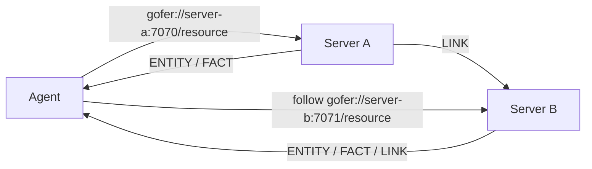

# Gopher-NG

> The Web evolved for humans. Gopher may have been waiting for machines.

**A tiny federated discovery protocol for autonomous agents: semantic resources, traversable links, and no Web application stack.**

> **Status: experimental.** This repository contains the Gopher-NG v0.0.1 Core protocol and reference implementation.

**[GOFER's Ambition](docs/gofers-ambition.md)** · **[Core protocol](docs/protocol.md)** · **[Gopherism](docs/gopherism.md)** · **[Federation proof](examples/federation/README.md)** · **[Python interoperability proof](interop/python/README.md)**

## The 30-second version

An agent asks one location:

```text
gofer://animals.example:7070/dog/123
```

and receives a finite semantic description:

```text
ENTITY	animal:Dog	animal:dog-123
FACT	animal:name	Moko
LINK	animal:owner	gofer://people.example:7070/person/456
```

The `LINK` points to another Gopher-NG resource, which may be served by a completely independent operator.

```text
location → semantic facts → traversable links → another location
```

No HTML. No JavaScript. No central registry. No tool execution. The Core protocol stops deliberately at discovery and traversal.

## Why this exists

Modern agents often need to discover information without needing the presentation and application machinery built for human-facing software.

Gopher-NG explores a deliberately smaller model:

- ask for one semantic resource;
- receive a finite, machine-readable response;
- follow explicit semantic links to other resources;
- let independent servers form a traversable information space;
- keep discovery separate from execution.

Gopher-NG does **not** attempt to replace HTTP, the Web, MCP, databases, ontologies, or tool-execution protocols. Its job is narrower: make distributed information simple to expose, simple to discover, and simple for machines to traverse.

## How federation works



There is no mandatory registry in the middle. Federation is represented by ordinary `LINK` records containing absolute `gofer://` URIs.

The repository includes a runnable **two-server federation proof** in [`examples/federation`](examples/federation/README.md).

## Gopher-NG, HTTP/Web, and MCP

These systems solve different problems. The comparison is about scope, not replacement.

| Dimension | Gopher-NG Core | HTTP / Web ecosystem | MCP |
| --- | --- | --- | --- |
| Primary job | Semantic discovery and traversal | General resource/application transport and human-facing Web ecosystem | Agent interaction with tools, resources, and other server capabilities |
| Execution semantics | **No** | Application-defined | **Yes**, notably tools |
| Presentation layer | **No** | Commonly yes | No |
| Traversal primitive | Semantic `LINK` | URLs, hyperlinks, and application-specific contracts | Resources and server-defined capabilities; traversal is not the Core purpose |
| Mandatory central registry | **No** | No | No |
| Core request shape | One selector | Methods, headers, bodies, status codes, negotiation, etc. | Richer JSON-RPC-based protocol |

**Gopher-NG is not another tool protocol. It stops deliberately before execution begins.**

That separation is a feature: a discovery layer can point at information or systems without also defining how those systems execute actions.

## Quick start

Clone the repository:

```sh
git clone https://github.com/hisashiishihara/gopher-ng.git
cd gopher-ng
```

Start the reference daemon:

```sh
go run ./cmd/gngd -listen 127.0.0.1:7070
```

In another terminal, retrieve the root resource:

```sh
go run ./cmd/gng gofer://127.0.0.1:7070/
```

```text
ENTITY	gopher-ng:Server	gopher-ng:root
```

An unknown valid selector returns a Core error response:

```sh
go run ./cmd/gng gofer://127.0.0.1:7070/missing
```

```text
ERROR	NOT_FOUND
```

`127.0.0.1:7070` is a reference-implementation/development default. Gopher-NG v0.0.1 defines no protocol default port.

## Run the federation proof

The most important demonstration is already in the repository: two independent Gopher-NG servers linked only by a Core `LINK` record.

Start Server B:

```sh
go run ./examples/federation/server-b -listen 127.0.0.1:7071
```

Start Server A and point its `LINK` at Server B:

```sh
go run ./examples/federation/server-a \
  -listen 127.0.0.1:7070 \
  -target gofer://127.0.0.1:7071/resource
```

Query Server A:

```sh
go run ./cmd/gng gofer://127.0.0.1:7070/
```

```text
ENTITY	example:Directory	example:federation-root
LINK	related	gofer://127.0.0.1:7071/resource
```

Follow the returned link:

```sh
go run ./cmd/gng gofer://127.0.0.1:7071/resource
```

```text
ENTITY	example:Resource	example:federation-target
FACT	example:message	Hello from server B
```

That is the federation model: independent servers, explicit semantic links, and no Web application stack or central registry required.

See [`examples/federation/README.md`](examples/federation/README.md) for the full walkthrough.

## Independent interoperability proof

The repository also contains a small Python implementation written from the protocol specification rather than from the Go internals.

It demonstrates both directions:

```text
Go client     → Python server
Python client → Go server
```

See [`interop/python/README.md`](interop/python/README.md).

This matters because Gopher-NG is intended to be a protocol, not merely a Go package. Independent implementations should be able to interoperate from the specification alone.

## Core protocol at a glance

Gopher-NG v0.0.1 uses the `gofer://` URI scheme and plain TCP.

Its transaction model is intentionally small:

```text
one connection
one selector
one complete response
explicit response completion
connection close
```

Core responses contain only four record types:

- `ENTITY` — identifies the semantic entity represented by the selector;
- `FACT` — states a fact about that entity;
- `LINK` — points to another traversable Gopher-NG resource;
- `ERROR` — returns a small symbolic protocol error.

On the wire, every complete response ends with an explicit `.` completion line before the connection closes.

Full normative details are in [`docs/protocol.md`](docs/protocol.md).

## What Core deliberately does not define

The Core protocol does not define:

- HTTP-style methods or headers;
- sessions, cookies, request bodies, or content negotiation;
- TLS or authentication in v0.0.1;
- ontology schemas or database models;
- query/search syntax;
- mutation or subscriptions;
- automatic recursive `LINK` traversal;
- service execution or tool invocation;
- MCP integration;
- a mandatory discovery registry.

A feature is not accepted merely because it is useful. The stricter question is:

> Does the protocol still work cleanly without it?

If the answer is yes, removal is preferred.

## Gopherism

Gopher-NG is guided by **Gopherism**: the idea that a network protocol should expose information with the minimum machinery necessary for a human or program to retrieve, traverse, and understand it.

In practice:

- information comes before presentation;
- navigation comes before application behavior;
- one request should mean one thing;
- discovery is separate from execution;
- federation happens through traversable links rather than a mandatory central registry;
- semantic meaning belongs outside the transport core;
- protocol complexity must justify its existence.

See [`docs/gopherism.md`](docs/gopherism.md) for the longer design rationale and [`docs/gofers-ambition.md`](docs/gofers-ambition.md) for the project hypothesis and success criterion.

## Implementation status

The current reference implementation supports the minimal v0.0.1 transaction: an absolute `gofer://` URI with explicit host and port, one selector, one Core response with an explicit terminator, and connection close.

It uses plain TCP. It does not implement TLS, authentication, automatic traversal, recursive `LINK` following, service execution, MCP, ontology interpretation, persistence, or discovery registries. The current reference client does not automatically follow `LINK` records or impose an explicit response-size limit.

For an optional private-network deployment example, see [Gopher-NG over Tailscale](docs/tailscale.md).

## License

Licensed under the [BSD 3-Clause License](LICENSE).

## Design direction

Gopher-NG should remain recognizable as Gopher in spirit, not merely in name. Compatibility with the historical protocol is less important than preserving its essential character: small requests, finite responses, traversable information, independent servers, and very little machinery between a client and the thing it wants to know.

Gopher is not interesting because it is old.

It is interesting because the Web became complicated enough for its old constraints to become useful again.
